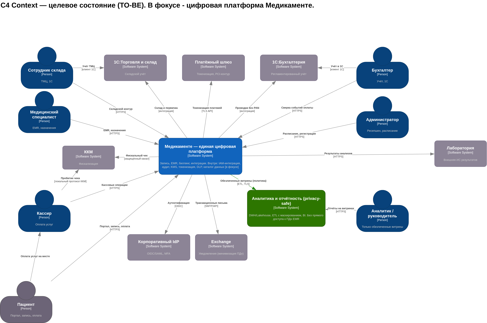

# Медикаменте: конфиденциальность (Privacy by Design), C4 Context To-Be и аналитический слой

Текущий ландшафт (AS-IS), риски для ПДн и медицинских данных, целевые принципы PbD и механизмы **до закупки и внедрения**; контекстная архитектура To-Be (C4) и обособленный контур аналитики с обезличиванием.

Аудит разрывов и целевые потоки: [`../Task1/PROBLEMS.md`](../Task1/PROBLEMS.md), [`../Task1/SOLUTION.md`](../Task1/SOLUTION.md).

---

## Диаграмма C4 Context (TO-BE)

Исходник в draw.io: [`architecture.drawio.xml`](architecture.drawio.xml). Растровый экспорт:

---

## 1. AS-IS: где ломается конфиденциальность

В текущем ландшафте критичные данные (ПДн, медицинская тайна, финансы) сосредоточены в **файловом контуре** (Excel, сканы на общем диске) и обмениваются с **1С**, **ККМ** и **почтой** без единого уровня абстракции «сервис приложения» с политиками доступа. Отсюда следуют типовые риски: отсутствие сквозного аудита, слабое разграничение, дублирование чувствительных копий, отсутствие управляемого lineage и DLP (детализация в [`PROBLEMS.md`](../Task1/PROBLEMS.md)).

---

## 2. Принципы Privacy by Design, которые закрепляем в архитектуре

| Принцип | Как отражается в To-Be (до выбора вендоров) |
|--------|---------------------------------------------|
| Проактивность, а не реактивность | Политики и DPIA **до** подключения новых потоков; запрет по умолчанию для выгрузок |
| Privacy как настройка по умолчанию | Минимальные наборы полей в API; маскирование в непривилегированных каналах |
| Privacy встроен в дизайн | IdP, KMS, токенизация, каталог данных — **первичные** строительные блоки, не «надстройка» |
| Полная функциональность | Аналитика и отчётность — на **обезличенных витринах**, без обхода операционного контура |
| Сквозная безопасность | mTLS/API Gateway между доменами; неизменяемые журналы; SIEM/UEBA |
| Видимость и прозрачность | Consent/цели обработки, уведомления; lineage из каталога данных |
| Уважение к пользователю | Портал согласий, ограничение маркетинговых коммуникаций, сроки хранения |

---

## 3. Новые блоки целевой системы (уровень C4 — контекст и логика контейнеров)

Ниже — **новые или существенно перестроенные** блоки относительно текущего (AS-IS) ландшафта по [`документации потоков данных`](../Task1/SOLUTION.md). На контекстной диаграмме часть из них показана как отдельные программные системы (граница доверия или внешний поставщик); при детализации до **Container** они «проваливаются» внутрь платформы «Медикаменте» или смежного контура.

| Блок (C4) | Тип на контексте | Назначение с точки зрения PbD |
|-----------|------------------|-------------------------------|
| **Единая цифровая платформа «Медикаменте»** | Software System (в фокусе) | Операционные домены: запись, EMR, биллинг, интеграции — единые политики, аудит, шифрование |
| **Корпоративный IdP / IAM** | External Software System (или контейнер) | MFA, RBAC/ABAC, минимизация сессий и зон доверия |
| **Шлюз API и политики трафика (API Gateway, WAF)** | Контейнер внутри платформы | Контракты схем, rate limit, проверка токенов, отсечение утечек на периметре |
| **Сервис согласий и целей обработки** | Контейнер | Фиксация правовых оснований, отзыв, связь с CRM/EMR |
| **KMS / HSM и управление ключами** | Контейнер | Шифрование at rest, ротация ключей, разделение обязанностей |
| **Сервис токенизации платежей** | Контейнер + внешний платёжный провайдер | ПДн платёжного инструмента не хранятся в 1С/журналах учёта |
| **DLP и классификация данных** | Контейнер | Контроль каналов выгрузки, метки чувствительности |
| **Каталог данных и lineage** | Контейнер | Прослеживаемость копий, DPIA, матрица доступа |
| **SIEM / UEBA и журнал аудита доступа** | Контейнер (или управляемый внешний SaaS) | Обнаружение аномалий, доказательная база расследований |
| **Политика тегов данных и проверки в CI/CD** | Процесс + контейнер «Policy-as-code» | Блокировка релизов без тегов `privacy.*` / `pdn.*` (см. [`Task1/SOLUTION.md`](../Task1/SOLUTION.md)) |

Эти блоки закрывают разрывы из [`PROBLEMS.md`](../Task1/PROBLEMS.md): аудит, RBAC/ABAC, минимизация, маскирование, lineage, DLP, UEBA.

---

## 4. Аналитический слой с Privacy by Design

**Идея слоя:** аналитика и корпоративная отчётность **не читают** операционные хранилища с ПДн напрямую. В контексте C4 выделена отдельная программная система **«Аналитика и отчётность (privacy-safe)»**, которая получает только потоки, прошедшие **ETL с маскированием, псевдонимизацией и агрегацией** (согласовано с TO-BE DFD в [`Task1/SOLUTION.md`](../Task1/SOLUTION.md)).

| Элемент слоя | Роль в PbD |
|----------------|------------|
| Зона подготовки данных (staging) | Отсечение прямых идентификаторов до загрузки в озеро |
| Хранилище (DWH / Lakehouse) | Разделение витрин по классам данных; шифрование; изолированная сеть |
| BI / отчёты / ML | Доступ только к витринам `restricted → anonymized`; отдельные учётные записи без доступа к EMR |
| Каталог и запросы | Описание каждой витрины, DPIA-привязка, сроки и право на удаление через обратный поток политик |

Связь с операционной платформой на контекстной диаграмме подписана как передача **обезличенных / минимизированных наборов по политике**, а не как «полная копия базы».

---

## 5. Артефакты

| Артефакт | Путь |
|----------|------|
| Диаграмма C4 **Context TO-BE** (draw.io) | [`architecture.drawio.xml`](architecture.drawio.xml) |
| Растровый экспорт диаграммы | [`img/architecture.png`](img/architecture.png) |

Дальнейшая детализация до уровня **Container** для платформы «Медикаменте» может перенести часть блоков (IdP, SIEM) внутрь границы системы или наоборот вынести в корпоративный ландшафт — это решение интегратора; контекст TO-BE остаётся стабильным при таких вариантах.
