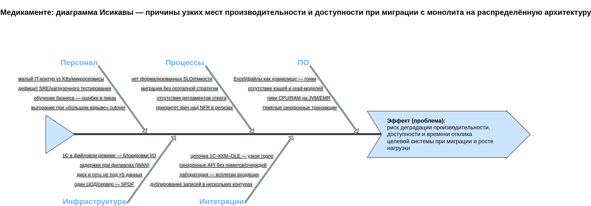

# Медикаменте: узкие места производительности при миграции — анализ по Исикаве

Отчёт фиксирует причины возможной деградации производительности, доступности и времени отклика при переходе от текущего ландшафта (Excel, общий диск, 1С в файловом режиме, один сервер) к распределённой платформе с ростом данных, филиалами и клиентским трафиком. Опора на текущее описание процессов и целей: [`../Task1/SOLUTION.md`](../Task1/SOLUTION.md), [`../Task1/PROBLEMS.md`](../Task1/PROBLEMS.md), [`../Task2/SOLUTION.md`](../Task2/SOLUTION.md).

---

## 1. Ситуация и цели миграции

**Текущее состояние.** Операции с данными преимущественно ручные; журналы, медкарты и платежи размазаны по Excel, сканам на общем диску и 1С; межсистемные потоки слабо формализованы; один физический контур без выделенной отказоустойчивости под прикладной уровень.

**Цель миграции.** Единая цифровая платформа (запись, EMR, биллинг, интеграции), масштабирование под **пятикратный** рост данных и клиентов, филиалы, мобильный клиент, лаборатория по API, аналитика на обезличенных витринах. НФТ: конфиденциальность, масштабируемость, сопровождаемость, конфигурируемость.

**Компоненты и потоки, критичные для производительности при переходе.** Файловые и Excel-хранилища; СУБД операционных доменов; объектное хранилище вложений; API Gateway и межсервисная сеть; очереди и интеграции с 1С, ККМ, лабораторией; ETL в аналитический контур; идентификация, кэш, read-модели; каналы до филиалов.

---

## 2. Диаграмма Исикавы

Исходник draw.io: [`ishikawa.drawio.xml`](ishikawa.drawio.xml). На диаграмме «головой» обозначен риск деградации производительности и доступности; к «позвоночнику» подведены пять категорий причин с типовыми проявлениями для «Медикаменте».

---

## 3. Категории причин и возможные проблемы

| Категория | Возможные проблемы (влияние на производительность и доступность) |
|-----------|-------------------------------------------------------------------|
| **Инфраструктура** | Один ЦОД и сервер как SPOF; запас по CPU/RAM/диску и IOPS не рассчитан на ×5 данных и пиковый трафик портала; при филиалах — задержки и потери на WAN без edge-кэша и выноса read-ближе к пользователю; файловый режим 1С — блокировки и конкуренция за диск при параллельной работе и интеграциях. |
| **Программное обеспечение** | Конкурентная запись в Excel/общие файлы при промежуточном гибриде; отсутствие кэширования и разделения read/write в EMR и расписании; N+1 и синхронные длинные транзакции при переносе бизнес-логики; рост задержек GC и пиков памяти в JVM-сервисах без лимитов и профилирования. |
| **Интеграция** | Синхронные цепочки 1С–ККМ–OLE и блокирующие вызовы в шину без таймаутов и идемпотентности; отсутствие backpressure (очереди, rate limit) — каскадные отказы; лаборатория и внешние API дают всплески входящих запросов; дублирование одних и тех же сущностей в Excel, 1С и новой платформе увеличивает объём согласований и фоновых синхронизаций. |
| **Персонал** | Узкий IT-контур при росте числа сервисов и кластеров; дефицит практик SRE и регулярного нагрузочного тестирования; обучение бизнес-пользователей новым интерфейсам без поэтапного снижения ручных обходных путей — ошибочные массовые операции создают пики; риск выгорания при «большом взрыве» миграции без поэтапного cutover. |
| **Процессы** | Нет заранее зафиксированных SLO и расчёта ёмкости под рост и филиалы; приоритет функциональности над НФТ в релизах без бюджета на техдолг; отсутствие регламентов отката и репетиций disaster recovery; миграция данных без чётких окон и критериев готовности ведёт к простоям и повторной обработке. |

---

## 4. Рекомендуемые меры и приоритет

Обозначения: **P0** — до первого значимого релиза на прод; **P1** — в первые месяцы эксплуатации; **P2** — по мере роста нагрузки и филиалов.

| Мера | Закрывает (категории) | Приоритет |
|------|------------------------|-----------|
| Зафиксировать SLO (доступность, p95 latency) и бюджет ошибок; построить минимальный capacity plan под ×5 и пик портала | Процессы, Инфраструктура | **P0** |
| Ввести API Gateway с лимитами, таймаутами, идемпотентностью; асинхронизировать тяжёлые интеграции (очереди/outbox) | Интеграция, ПО | **P0** |
| Нагрузочное и хаос-тестирование критичных сценариев (запись, оплата, чтение EMR, интеграция лаборатории) в CI | Персонал, ПО, Процессы | **P0** |
| Стратегия миграции данных: поэтапный dual-write / синхронизация с контрольными точками и откатом, а не единый cutover «в один день» | Процессы, Интеграция | **P0** |
| Резервирование и план восстановления для операционных БД и брокеров; мониторинг золотых сигналов (latency, traffic, errors, saturation) | Инфраструктура, Процессы | **P1** |
| Кэш и read-модели для расписания и справочников; разделение тяжёлых отчётов от онлайн-транзакций | ПО, Инфраструктура | **P1** |
| Edge или read-реплики ближе к филиалам либо контролируемый офлайн-режим критичных функций при деградации канала | Инфраструктура, Интеграция | **P2** |
| Расширение команды эксплуатации (SRE) или управляемые сервисы провайдера под согласованные SLA | Персонал, Инфраструктура | **P2** |

---

## 5. Выводы

1. Узкие места при миграции **не сводятся к одному серверу или к микросервисам сами по себе**: одновременно действуют ограничения интеграций, гибридного состояния с Excel/1С, процессов планирования нагрузки и ограниченного персонала эксплуатации.
2. Наибольший эффект дают связка **лимитов и асинхронности на границах**, **ёмкостное планирование с SLO** и **поэтапная миграция с репетициями** — это снижает риск каскадных отказов и неожиданных пиков при включении филиалов и мобильного трафика.
3. Диаграмма в [`ishikawa.drawio.xml`](ishikawa.drawio.xml) служит рабочей картой для уточнения причин на ретроспективах архитектуры и для дополнения регламентом по нагрузочному тестированию перед каждым крупным релизом.
