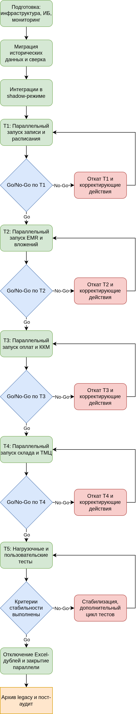

# Медикаменте: стратегия миграции и cutover-план

Документ фиксирует выбранный подход к переходу от ландшафта Excel, общего диска и 1С в файловом режиме к целевой цифровой платформе (запись, EMR, биллинг, интеграции), поэтапный cutover, критические точки, риски и распределение ответственности. Исходные процессы, цели и целевой контур согласованы с [`../Task1/SOLUTION.md`](../Task1/SOLUTION.md), [`../Task1/PROBLEMS.md`](../Task1/PROBLEMS.md), [`../Task2/SOLUTION.md`](../Task2/SOLUTION.md), [`../Task3/SOLUTION.md`](../Task3/SOLUTION.md), [`../Task4/SOLUTION.md`](../Task4/SOLUTION.md).

---

## 1. Текущая ситуация и цели перехода

**AS-IS.** Данные размазаны по журналам Excel, сканам на **общем диске**, дублирующим таблицам у касс; 1С «Бухгалтерия» и «Торговля и склад» в файловом режиме; ККМ связаны с 1С; нет единого аудита и формализованных API на границах доменов.

**Цели.** Единая операционная платформа под рост нагрузки и филиалы, мобильная запись, интеграция лаборатории, усиление конфиденциальности; безопасный перевод пользователей и данных без «большого взрыва», с возможностью остановить перевод при деградации.

---

## 2. Сравнение трёх подходов (кратко)

| Подход | Суть для «Медикаменте» | Плюсы | Минусы |
|--------|------------------------|-------|--------|
| **Проектирование с учётом домена и модульных границ** | Сначала жёстко очерчиваем bounded context, потом переносим модули | Ясные владельцы данных и контракты; меньше «спагетти» интеграций | Само по себе не снимает риск единовременного переключения пользователей и не задаёт режим сосуществования систем |
| **Parallel run** | Старая и новая цепочки работают одновременно; нагрузка и ответственность за данные переносятся поэтапно | Сравнение результатов, обучение, откат на знакомый контур; приемлемо при ПДн и оплатах | Дороже в эксплуатации; нужна синхронизация и правила «источника истины» на каждом этапе |
| **Branch by abstraction** | За фасадом постепенно меняют реализацию (legacy → новый сервис) | Хорошо для API и кода; снижает связность | Для Excel/сканов как основного носителя требует предварительно вынести данные в управляемые хранилища и контракты; один фасад не закрывает массовое обучение персонала и смену привычных ручных процедур |

---

## 3. Выбранная стратегия: Parallel run (параллельный запуск)

**Решение:** основной режим миграции — **параллельный запуск** старого и нового контура по **доменам** (запись и расписание → EMR и вложения → оплаты и события для 1С → склад и ТМЦ → отчётность и аналитика), с явным системным владельцем данных на каждом отрезке времени.

**Обоснование.**

1. **Регуляторика и клиника.** Ошибка в медкарте или расхождение оплаты критичнее, чем задержка релиза; параллельный режим даёт окно сверки и привыкания персонала.
2. **Гетерогенный AS-IS.** Параллельный запуск не требует заранее полностью «спрятать» Excel за одной абстракцией: можно сначала стабилизировать поток в новую систему, оставив Excel как журнал контроля на переходный период.
3. **Интеграции 1С и ККМ.** Фискальный и бухгалтерский контур остаётся рабочим; в платформу попадают события и агрегаты, сверяемые с 1С, что снижает риск разрыва с текущей учётной политикой.
4. **Согласованность с НФТ.** Подход стыкуется с рекомендациями по поэтапному dual-write, нагрузочным прогонам и SLO из отчёта по производительности: каждый домен проходит нагрузочную и пользовательскую приёмку до расширения доли трафика.

**Ограничения выбора.** Выше операционные затраты (двойной ввод или синхронизация), дисциплина регламентов; без жёсткого календаря отключения legacy возможен «вечный гибрид» — в cutover-плане зафиксированы контрольные даты и критерии выхода из параллели по каждому домену.

Элементы **доменного разбиения** используются при планировании волн, а **фасады и очереди** на границе с 1С и лабораторией — как технические средства параллели, без смены названия стратегии.

---

## 4. Логика cutover (блок-схема)

Исходник draw.io: [`flowchart.drawio.xml`](flowchart.drawio.xml). Направление: сверху вниз; зелёные шаги — основная цепочка и волны T1–T5, синие ромбы — Go/No-Go (после T5 — проверка критериев стабильности), красные блоки — откат или дополнительный цикл тестов с возвратом на предыдущий шаг.

---

## 5. Cutover-план (этапы)

| Этап | Описание действия | Ключевые задачи | Ответственные | Время / сроки | Риски и меры по снижению |
| --- | --- | --- | --- | --- | --- |
| P0 — Инициация и границы | Утвердить волны, владельцев доменов, критерии готовности и SLO | Дорожная карта; матрица данных «источник истины» по фазам; коммуникация с отделами | Технический директор, руководитель клиники (операции), бизнес-аналитик | Недели 1–2 | Риск срыва сроков из-за неясных границ → фиксация RACI и протокола изменений |
| P1 — Платформа и ИБ | Развернуть контуры платформы, IAM, журналирование, резервное копирование | Кластеры, сетевые сегменты, KMS, политики ролей, мониторинг золотых сигналов | Администратор инфраструктуры, техдир, внешний ИБ по контракту | Недели 2–6 | Недостаточная ёмкость → capacity plan под ×5; пилот нагрузки |
| P2 — Исторические данные | Перенести справочники, пациентов, договоры, архив сканов в управляемые хранилища | ETL/загрузки, контрольные суммы, выборочная сверка с Excel/диском | Бизнес-аналитик, владелец данных (ресепшен/АРМ), разработка/интегратор | Недели 4–10 | Искажения при переносе → контрольные выборки, повторный прогон, freeze на время cut |
| P3 — Интеграции shadow | Включить обмен с 1С, ККМ, почтой, тестовым контуром лаборатории без боевого UI | Тестовые брокеры, идемпотентность, таймауты, DLQ; без записи в боевую 1С без флага | Разработка, администратор 1С, техдир | Недели 6–12 | Каскадные сбои → лимиты на шлюзе, feature flags |
| T1 — Параллель: запись | Новый канал записи (портал/АРМ) + дублирующая запись в контрольный Excel по регламенту | Обучение ресепшена; сверка слотов ежедневно; дефекты в бэклог | Руководитель ресепшена, бизнес-аналитик, разработка | 2–4 недели пилот | Ошибки расписания → ограничение доли онлайн-записей, горячая линия IT |
| T2 — Параллель: EMR | Ведение приёма в EMR; Excel/диск только для ввода «хвоста» и сверки | Импорт шаблонов, MFA, аудит чтения; миграция сканов в объектное хранилище | Главный врач / зам. по качеству, медспециалисты, IT | 4–8 недель | Сопротивление врачей → суперпользователи, сокращение полей ввода |
| T3 — Параллель: оплаты | Касса: событие в платформе → проводка в 1С; сверка Z-отчётов и журналов | Токенизация/шлюз; чековый контур; nightly reconcile | Кассиры, бухгалтерия, разработка | 4–6 недель | Расхождение сумм → автоматическая сверка, стоп-лист касс до устранения |
| T4 — Параллель: склад | Операции ТМЦ в новом модуле; отражение в 1С «Торговля и склад» по событиям | Двойной ввод сокращается по мере стабилизации; инвентаризация на границе волны | Завсклад, бухгалтерия, IT | 3–6 недель | Остатки разъехались → инвентаризация, заморозка движений на cut-ночь |
| T5 — Нагрузочное и UX-тестирование | Прогнать сценарии записи, EMR, оплаты, интеграции лаборатории под целевым профилем | Нагрузочные тесты, хаос-сценарии отказа брокера; чек-листы приёмки | Техдир, QA/интегратор, админ | 2–3 недели | Пропуск пиков → тест из Task4 сценариев; бюджет ошибок |
| G — Go/No-Go | Совещание по каждой волне: метрики, инциденты, доля трафика | Критерии: p95 latency, ошибки < порога, нет блокирующих дефектов | Техдир, владелец домена, руководитель клиники | В конце каждой волны | Преждевременный go → формальный veto ИБ/бухгалтерии |
| M — Мониторинг и сопровождение | 24/7/on-call на период параллели; ежедневный дашборд расхождений | Алерты по reconcile, очередям, 1С; war room в пик смен | Администратор, дежурный разработчик, координатор от бизнеса | Вся параллель | Усталость персонала → ротация, сокращение объёма ручной сверки автоматизацией |
| R — Откат | Для каждой волны: переключение на legacy-процедуру, отключение записи в новый контур, сохранение данных | Runbook: кто стопит шлюз, кто уведомляет отделы, где «заморозка» 1С | Техдир, администратор, владелец домена | По триггеру | Потеря данных при откате → журнал outbox, запрет деструктивных миграций без бэкапа |
| Z — Закрытие параллели | Отключить контрольные Excel/ручные дубли по домену; заархивировать AS-IS | Юридический срок хранения сканов; read-only архив; обновление регламентов | Руководитель клиники, бухгалтерия, техдир | После стабильного окна 2–4 недели | Возврат к Excel «по привычке» → контроль доступа и отключение шаблонов |
| Post — Пост-аудит | Проверка полноты журналов, прав доступа, линии данных в каталог | Выборочный аудит; уроки в backlog | Техдир, ИБ, бизнес-аналитик | 2–4 недели после Z | Незакрытые хвосты → единый реестр долгов |

**Числовые пороги Go/No-Go (SLO).** Целевые значения p95 по критичным API, допустимая доля ошибок и целевая доступность в таблице выше намеренно не заданы: их фиксирует рабочая группа **после пилотных нагрузочных замеров** и согласования с владельцами доменов и ИБ как обязательный артефакт перед расширением доли трафика на волне; до утверждения порогов решение Go считается преждевременным.

---

## 6. Критические моменты и меры

| Критическая точка | Почему важно | Меры |
|-------------------|--------------|------|
| Переключение «источника истины» по пациенту и слоту | Двойная запись даёт коллизии | Временные правила: в волне T1 источник слота — платформа; Excel — только копия; ежедневный reconcile |
| Первая оплата через новый контур | Прямой финансовый и фискальный эффект | Сначала низкоденежные услуги; обязательная сверка с Z-отчётом; откат на кассовый сценарий AS-IS |
| Cut ночью по складу | Риск расхождения остатков | Инвентаризация, стоп отгрузок, поэтапное включение номенклатуры |
| Пик записи через мобильный канал | Новая нагрузка | Лимиты на шлюзе, очередь, кэш справочников; деградация — только запись через ресепшен |

---

## 7. Риски стратегии parallel run и план реагирования

| Риск | Проявление | Действия |
|------|------------|----------|
| Рассинхронизация данных | Разные ФИО/время/суммы в Excel и платформе | Автоматический reconcile, приоритет полей по политике домена, ручной war room до устранения |
| Операционная перегрузка | Двойной ввод, ошибки | Сокращение объёма параллели по доменам; временный найм; бонусы за дисциплину сверки |
| Зависимость от 1С в файловом режиме | Блокировки, деградация при росте интеграций | План перевода 1С на клиент-сервер или управляемый режим вне рамок волны T3 (отдельный трек) |
| Задержка обучения | Саботаж или обход в Excel | KPI по использованию EMR/портала; отключение прав на запись в старые файлы после G |
| Инцидент ИБ | Утечка при двух контурах | Минимизация копий ПДн; DLP; сегментация сети; пост-инцидент с уроком для следующей волны |

---

## 8. Распределение ответственности (сводка)

| Роль | Зона ответственности |
|------|----------------------|
| Технический директор | Архитектура, go/no-go, приоритеты, эскалация перед руководством |
| Администратор инфраструктуры | Доступность, резервы, мониторинг, выполнение runbook отката |
| Бизнес-аналитик | Маппинг данных, приёмочные сценарии, обучение материалами |
| Владелец домена (ресепшен / касса / склад / врачи) | Качество данных в своей волне, обучение сотрудников, сигнал о stop |
| Бухгалтерия | Сверка денежных потоков и 1С, блокирующее «но» по T3 |
| Разработка / интегратор | Реализация шлюзов, очередей, идемпотентности, исправление дефектов |
| Руководитель клиники | Ресурс времени персонала, коммуникация с пациентами при инцидентах |

---

## 9. Выводы

1. Для «Медикаменте» выбран **parallel run по доменам**: он сочетает управляемость риска для ПДн, оплат и медицинских записей с поэтапным снижением зависимости от Excel и общего диска.
2. Cutover задан таблицей этапов (подготовка → волны T1–T5 → мониторинг → откат → закрытие параллели → пост-аудит) и блок-схемой в разделе 4.
3. Успех определяется не только релизом, но **дисциплиной сверки**, **критериями go/no-go** и **заранее отработанным откатом** на уровне каждой волны.
